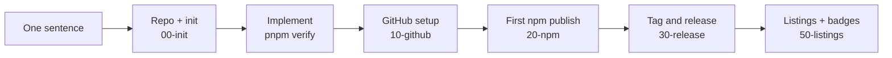

<div align="center">

# DSH plugin template

**Tell an AI one sentence. Get a DeepSeek Harness plugin from idea to listed.**

Repository, init, build, tests, CI, npm and GitHub releases, directory listings: all set up, and written down as playbooks an AI can follow.

[](https://github.com/new?template_name=dsh-plugin-template&template_owner=exoticknight)

[](https://github.com/exoticknight/dsh-plugin-template/actions/workflows/ci.yml) [](LICENSE) [](https://github.com/exoticknight/red)

[简体中文](README.md) | English

</div>

> [!IMPORTANT]
> **AI agents:** this is an uninitialized template. Read [`AGENTS.md`](AGENTS.md), then follow [`playbooks/00-init.md`](playbooks/00-init.md). Do not write plugin code before initialization.

## Start in 30 seconds

Send this to Claude Code, Codex, Cursor or any coding agent, with your own feature filled in:

```text
Use https://github.com/exoticknight/dsh-plugin-template to create a DSH plugin
called dsh-foo that … Publish it to npm.
```

The agent creates your repository, initializes it, implements the feature, sets up GitHub and npm, ships the first release, and helps you submit it to plugin directories. It only stops for what must be you: logging in to npm and the first publish.

## From one sentence to listed



Each step has a [playbook](playbooks/) with its goal, preconditions, commands to run and a definition of done. Upgrades, releases and maintenance later work the same way.

## What you get

**🧩 A plugin skeleton that runs**

- Host entry in the DSH Node process, mounted by Cordis, with a config schema
- Client entry in the DSH page, bundled for the DSH module loader; drop it for service-only plugins
- esbuild: `@deepseek-ai/*` comes from DSH, plugin name and version are injected at build time

**✅ Quality gates**

- TypeScript strict; contract tests for package metadata, Cordis mount and unmount, client registration
- npm tarball check: entry files present, no source or tests leaking in
- Release gate: tag matches version, repository URL is right, no placeholders left

**🚀 Release with one tag**

- CI on Ubuntu / Windows × Node 22.19 / 24
- npm Trusted Publishing, plus a GitHub Release with release notes
- Prereleases go to npm `next`; every step is safe to re-run
- GitHub-only distribution with `--no-npm`

**🧪 Local testing that leaves your DSH alone**

- `pnpm dev` links the checkout into the isolated home `.dsh-dev` inside the repository and starts DSH; `pnpm smoke` installs a published version the way users do, in a throwaway home. Both verify the isolation and never touch your everyday DSH

**🤖 Playbooks written for AI**

| File                                              | Contents                                                                     |
| ------------------------------------------------- | ---------------------------------------------------------------------------- |
| [`AGENTS.md`](AGENTS.md)                          | Entry point: facts, rules, which playbook for which task (`CLAUDE.md` imports it) |
| [`00-init`](playbooks/00-init.md)                 | Collect parameters, create the repository, initialize, first commit          |
| [`10-github`](playbooks/10-github.md)             | Metadata, Actions permissions, npm environment, tag protection, security     |
| [`20-npm`](playbooks/20-npm.md)                   | First publish, Trusted Publisher, disallowing tokens                         |
| [`30-release`](playbooks/30-release.md)           | Releasing, verification, recovery for each failure point                     |
| [`40-maintain`](playbooks/40-maintain.md)         | DSH upgrades, Node versions, Dependabot, pulling template updates            |
| [`50-listings`](playbooks/50-listings.md)         | Directory submissions, follow-up, listing badges                             |
| [`reference/`](playbooks/reference/checklist.md)  | Full checklist, README writing guide, directory list, badge rules                     |

**📦 Repository conventions**

- Dependabot, bug report template, bilingual README, CONTRIBUTING, SECURITY, CHANGELOG
- Research, changes and documentation managed with [RED](https://github.com/exoticknight/red)

## What only you do

The playbooks make the agent stop and hand these to you:

- `npm login` and the first `npm publish` (your account and 2FA code)
- Configuring the Trusted Publisher on npmjs.com
- Approving directory submissions made in your name

The agent does everything else.

## Other ways to start

**Copy, then an agent.** Click **Use this template** above (or clone the repository), open it with your agent and say _"initialize this plugin"_.

**Fully manual.** Requirements: Node.js `^22.19.0 || >=24`, pnpm, git, a logged-in GitHub CLI; a DSH CLI for local testing.

```sh
node scripts/init.mjs --name dsh-foo --owner <github-user> --dsh-version <dsh version> \
  --title "Foo" --description "Foo for DeepSeek Harness."
pnpm install
pnpm hooks:install
pnpm verify
```

Then follow [`10-github`](playbooks/10-github.md), [`20-npm`](playbooks/20-npm.md), [`30-release`](playbooks/30-release.md) and [`50-listings`](playbooks/50-listings.md).

<details>
<summary><b>init options</b></summary>

| Flag             | Required | Meaning                                                           |
| ---------------- | -------- | ----------------------------------------------------------------- |
| `--name`         | yes      | npm and repository name, `dsh-<slug>`                             |
| `--owner`        | yes      | GitHub user or organization                                       |
| `--dsh-version`  | yes      | DSH version the plugin is verified on                             |
| `--dsh-min`      |          | Minimum supported DSH (default: `--dsh-version`)                  |
| `--title`        |          | Display name (default: derived from the name)                     |
| `--description`  |          | One English sentence (default: "`<title>` for DeepSeek Harness.") |
| `--author`       |          | `package.json` author (default: owner)                            |
| `--keywords a,b` |          | Extra npm keywords                                                |
| `--host-only`    |          | No client entry; default profile becomes `headless`               |
| `--no-npm`       |          | GitHub-only; removes npm badges and install lines                 |
| `--dry-run`      |          | Show what would change                                            |

</details>

<details>
<summary><b>What init does</b></summary>

- Copies the plugin README skeletons in `.template/` over `README.md` (Chinese) and `README.en.md` (English), replacing this page
- Replaces every placeholder: `dsh-plugin-template`, `{{OWNER}}`, `{{PLUGIN_TITLE}}`, `{{DESCRIPTION}}`, `{{AUTHOR}}`, `{{DSH_VERSION}}`, `{{DSH_VERSION_BADGE}}`, `{{DSH_MIN_VERSION}}`, `{{DSH_PROFILE}}`
- Removes template-only content: the template section of `AGENTS.md`, `.template/`, and the init script itself; plus the client entry or npm parts when the flags ask for it
- Keeps `playbooks/` (releases and maintenance use them) and records the template in the `template` field of `package.json`

`__PLUGIN_NAME__` and `__PLUGIN_VERSION__` in `src/` are not placeholders. They are build-time constants that `scripts/build.mjs` fills from `package.json`.

</details>

<details>
<summary><b>Maintaining the template</b></summary>

- Mark the repository as a template so that `gh repo create --template` and the **Use this template** button work: `gh repo edit exoticknight/dsh-plugin-template --template`
- CI runs `pnpm verify` on the placeholder plugin, so the template itself always builds
- Never push a `v*` tag here; `check:release` rejects releases with placeholders anyway
- [`playbooks/reference/checklist.md`](playbooks/reference/checklist.md) records every convention the template standardizes. Change the checklist and the files together

</details>

---

Created and maintained by [exoticknight](https://github.com/exoticknight) · [Apache License 2.0](LICENSE)
