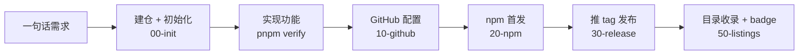

<div align="center">

# DSH 插件模板

**一句话交给 AI，从想法到上架一个 DeepSeek Harness 插件。**

建仓、初始化、构建、测试、CI、npm 与 GitHub 发布、插件目录收录，全部准备好，并写成 AI 能照着执行的手册。

[](https://github.com/new?template_name=dsh-plugin-template&template_owner=exoticknight)

[](https://github.com/exoticknight/dsh-plugin-template/actions/workflows/ci.yml) [](LICENSE) [](https://github.com/exoticknight/red)

简体中文 | [English](README.en.md)

</div>

> [!IMPORTANT]
> **AI agent：** 这是尚未初始化的模板。请先读 [`AGENTS.md`](AGENTS.md)，再按 [`playbooks/00-init.md`](playbooks/00-init.md) 执行。初始化前不要编写插件功能。

## 30 秒上手

把下面这句话发给 Claude Code、Codex、Cursor 或任何编程 agent，把功能换成你想要的：

```text
用 https://github.com/exoticknight/dsh-plugin-template 建一个 DSH 插件 dsh-foo，
功能是……，发布到 npm。
```

agent 会创建你的仓库、完成初始化、实现功能、配置 GitHub 和 npm、发布第一个版本，再帮你提交到插件目录。只有登录 npm、首次发布这类必须由你本人完成的步骤，它才会停下来问你。

## 从一句话到上架



每一步都有一份 [playbook](playbooks/)：写明目标、前置条件、可以直接执行的命令和完成标准。之后的升级、发版和维护也按同样的方式进行。

## 你会得到

**🧩 开箱即用的插件骨架**

- Host 入口运行在 DSH 的 Node 进程中，由 Cordis 挂载，带配置 schema
- Client 入口运行在 DSH 页面中，打包成 DSH 模块加载器使用的格式；纯服务插件可以一键去掉
- esbuild 构建：`@deepseek-ai/*` 由 DSH 提供，插件名和版本号在构建时注入

**✅ 不会坏的质量关卡**

- TypeScript strict，契约测试覆盖包元数据、Cordis 挂载与卸载、client 注册
- 检查 npm 包内容，确保入口文件齐全、源码和测试不会混入
- 发布前把关：tag 与版本一致、仓库地址正确、没有残留占位符

**🚀 一个 tag 完成发布**

- CI 覆盖 Ubuntu / Windows × Node 22.19 / 24
- npm Trusted Publishing，GitHub Release 附 tarball 和 SHA-256
- 预发布版本自动走 npm `next` 通道；每一步都能安全重跑
- 也可以只发布到 GitHub（`--no-npm`）

**🧪 不污染日常环境的本地调试**

- `pnpm dev` 把当前源码链接进仓库内的隔离目录 `.dsh-dev` 并启动 DSH；`pnpm smoke` 在一次性目录中按用户的方式安装已发布版本并验证。两者都会校验隔离是否生效，绝不改动你日常使用的 DSH

**🤖 写给 AI 的操作手册**

| 文件                                                       | 内容                                                          |
| ---------------------------------------------------------- | ------------------------------------------------------------- |
| [`AGENTS.md`](AGENTS.md)                                   | 入口：项目事实、规则、按任务选择手册（`CLAUDE.md` 导入它）    |
| [`00-init`](playbooks/00-init.md)                          | 收集参数、建仓、初始化、首次提交                              |
| [`10-github`](playbooks/10-github.md)                      | 仓库元数据、Actions 权限、npm environment、tag 保护、安全功能 |
| [`20-npm`](playbooks/20-npm.md)                            | 首次发布、配置 Trusted Publisher、禁止 token 发布             |
| [`30-release`](playbooks/30-release.md)                    | 发布版本、验证、各环节失败后的恢复方法                        |
| [`40-maintain`](playbooks/40-maintain.md)                  | DSH 升级、Node 版本、Dependabot、同步模板更新                 |
| [`50-listings`](playbooks/50-listings.md)                  | 提交插件目录、跟进状态、添加收录 badge                        |
| [`reference/`](playbooks/reference/checklist.md)           | 完整检查清单、README 写作规范、插件目录列表、badge 规则              |

**📦 完整的仓库规范**

- Dependabot、Bug 报告模板、中英双语 README、CONTRIBUTING、SECURITY、CHANGELOG
- 使用 [RED](https://github.com/exoticknight/red) 管理研究、变更与文档

## 需要你本人完成的事

手册会让 agent 在这些步骤停下来，交给你操作：

- `npm login` 和首次 `npm publish`（需要你的账号和两步验证码）
- 在 npmjs.com 上配置 Trusted Publisher
- 批准以你的名义向插件目录提交收录

其余步骤都由 agent 完成。

## 其他用法

**手动复制，再交给 agent。** 点击上方的 **Use this template**（或 clone 仓库），用 agent 打开后说「初始化这个插件」。

**完全手动。** 环境要求：Node.js `^22.19.0 || >=24`、pnpm、git、已登录的 GitHub CLI；本地测试需要 DSH CLI。

```sh
node scripts/init.mjs --name dsh-foo --owner <github-user> --dsh-version <dsh 版本> \
  --title "Foo" --description "Foo for DeepSeek Harness."
pnpm install
pnpm hooks:install
pnpm verify
```

然后依次按 [`10-github`](playbooks/10-github.md)、[`20-npm`](playbooks/20-npm.md)、[`30-release`](playbooks/30-release.md)、[`50-listings`](playbooks/50-listings.md) 操作。

<details>
<summary><b>init 参数</b></summary>

| 参数             | 必填 | 含义                                                   |
| ---------------- | ---- | ------------------------------------------------------ |
| `--name`         | 是   | npm 包名与仓库名，格式 `dsh-<slug>`                    |
| `--owner`        | 是   | GitHub 用户或组织                                      |
| `--dsh-version`  | 是   | 已验证的 DSH 版本                                      |
| `--dsh-min`      |      | 最低支持的 DSH 版本（默认同 `--dsh-version`）          |
| `--title`        |      | 显示名称（默认由包名生成）                             |
| `--description`  |      | 一句英文简介（默认 "`<title>` for DeepSeek Harness."） |
| `--author`       |      | `package.json` 作者（默认同 owner）                    |
| `--keywords a,b` |      | 额外的 npm 关键词                                      |
| `--host-only`    |      | 不要 client 入口，默认 profile 变为 `headless`         |
| `--no-npm`       |      | 只发布到 GitHub，去掉 npm badge 与安装说明             |
| `--dry-run`      |      | 只显示会改动的文件                                     |

</details>

<details>
<summary><b>初始化做了什么</b></summary>

- 把 `.template/` 中的插件 README 骨架复制为 `README.md`（中文）和 `README.en.md`（英文），替换本页
- 替换所有占位符：`dsh-plugin-template`、`{{OWNER}}`、`{{PLUGIN_TITLE}}`、`{{DESCRIPTION}}`、`{{AUTHOR}}`、`{{DSH_VERSION}}`、`{{DSH_VERSION_BADGE}}`、`{{DSH_MIN_VERSION}}`、`{{DSH_PROFILE}}`
- 删除仅属于模板的内容：`AGENTS.md` 中的模板说明段、`.template/`、初始化脚本本身；按参数删除 client 入口或 npm 相关内容
- 保留 `playbooks/`（发布和维护还要用），并在 `package.json` 的 `template` 字段记录模板来源

`src/` 中的 `__PLUGIN_NAME__` 与 `__PLUGIN_VERSION__` 不是占位符，而是 `scripts/build.mjs` 从 `package.json` 填入的构建常量。

</details>

<details>
<summary><b>维护模板</b></summary>

- 将仓库标记为模板，`gh repo create --template` 和 **Use this template** 按钮才能使用：`gh repo edit exoticknight/dsh-plugin-template --template`
- CI 会对占位符插件运行 `pnpm verify`，保证模板本身始终可以构建
- 不要在本仓库推送 `v*` tag；`check:release` 也会拒绝带占位符的发布
- [`playbooks/reference/checklist.md`](playbooks/reference/checklist.md) 记录模板统一的所有规范，修改规范时同步修改清单和对应文件

</details>

---

由 [exoticknight](https://github.com/exoticknight) 创建和维护 · [Apache License 2.0](LICENSE)
